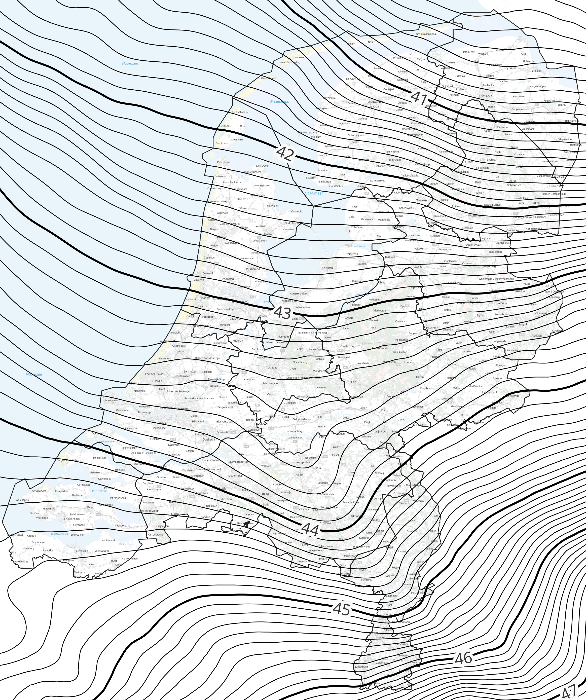

# Best practices

Dit hoofdstuk beschrijft een aantal best practices voor het serveren en
gebruiken van 3D tiles. Deze best practices zijn gebaseerd op de expertise en
praktijkervaring van de auteurs met betrekking tot het genereren, serveren en
gebruiken van 3D-tiling, zoals beschreven in deze handleiding

De best practices zijn beschreven aan de hand van vier onderwerpen (zie figuur 11):

<figure id="Figuur_x"> 

<figcaption>Het werken met 3D Tiles</figcaption>
</figure>

**Genereren van 3D Tiles**

1.  [Attribuutgegevens:](https://geonovum.github.io/3d-tiling/#attribuutgegevens)
    Gebruik van attribuutgegevens voor het verrijken van de 3D tiles en het
    verbeteren van de visualisatie.

2.  [Explicit en implicit
    tiling:](https://geonovum.github.io/3d-tiling/#explicit-en-implicit-tiling)
    Dit betreft de methoden en structuren die worden gebruikt om tiles te
    genereren.

3.  [Geometric error:](https://geonovum.github.io/3d-tiling/#geometric-error-0)
    Dit is een belangrijke parameter bij het genereren van tiles om de
    nauwkeurigheid van de geometrie te bepalen.

4.  [Offset
    Z-coördinaat:](https://geonovum.github.io/3d-tiling/#offset-z-coordinaat)
    Aanpassing van de Z-coördinaat bij het genereren van tiles om nauwkeurige
    plaatsing te garanderen.

5.  [Optimale set aan
    parameters:](https://geonovum.github.io/3d-tiling/#optimale-set-aan-parameters)
    Dit omvat de parameters die worden ingesteld bij het genereren van tiles
    voor optimale prestaties.

6.  [Shader:](https://geonovum.github.io/3d-tiling/#shader) Instellingen en
    optimalisaties van shaders voor het weergeven van 3D tiles.

7.  [Formaat:](https://geonovum.github.io/3d-tiling/#formaat) De keuze van het
    formaat waarin de 3D tiles worden opgeslagen tijdens het genereren.

8.  [Compressie:](https://geonovum.github.io/3d-tiling/#compressie) Technieken
    om de gegenereerde tiles te comprimeren voor efficiëntere opslag en
    transmissie.

**Valideren van 3D Tiles**

1.  [Valideren van 3D
    tiles:](https://geonovum.github.io/3d-tiling/#valideren-van-3d-tiles)
    Methoden en tools om de juistheid en integriteit van de gegenereerde tiles
    te controleren.

**Publiceren van 3D Tiles**

1.  [OGC API
    GeoVolumes:](https://geonovum.github.io/3d-tiling/#ogc-api-geovolumes)
    Specificaties en standaarden voor het publiceren en toegankelijk maken van
    3D tiles via API's.

2.  [Metadata:](#metadata-0) Het toevoegen van beschrijvende gegevens aan de
    tiles om ze beter vindbaar en bruikbaar te maken bij publicatie.

**Gebruiken van 3D Tiles**

1.  [Minimal zoom:](https://geonovum.github.io/3d-tiling/#minimal-zoom) Bepalen
    van het minimale zoomniveau waarop tiles worden weergegeven.

2.  [Kleur en
    belichting:](https://geonovum.github.io/3d-tiling/#kleur-en-belichting)
    Instellingen voor kleur en belichting bij het gebruik van 3D tiles.

3.  [WCAG:](https://geonovum.github.io/3d-tiling/#wcag) Overwegingen voor
    toegankelijkheid volgens de Web Content Accessibility Guidelines bij het
    gebruik van tiles.

4.  [Coördinaten van scherm/terrein en
    camera/doelobject:](https://geonovum.github.io/3d-tiling/#coordinaten-van-scherm-terrein-en-camera-doelobject)
    Beheer van coördinaten bij het weergeven en gebruiken van tiles.

5.  [Diepte vlak (depth
    plane):](https://geonovum.github.io/3d-tiling/#diepte-vlak-depth-plane)
    Gebruik van dieptevlakken voor correcte rendering van tiles in
    3D-omgevingen.

## Genereren van 3D Tiles

### Attribuutgegevens

>   Neem alleen de attributen op die nodig zijn voor visualisatie of voor het
>   opvragen van extra informatie via een andere server.

Het zorgvuldig kiezen van welke attributen worden opgenomen in 3D Tiles-datasets
is van belang voor efficiënt gegevensbeheer. Door enkel de essentiële attributen
toe te voegen, wordt onnodige gegevensuitwisseling voorkomen, wat de prestaties
verbetert en de netwerkbelasting vermindert. Daarnaast kan het selectief opnemen
van attributen waarop veelvuldig gefilterd wordt helpen bij het optimaliseren
van de dataset voor specifieke gebruiksscenario's.

Het opvragen van extra informatie via een andere server op basis van een unieke
identificatie biedt real-time toegang tot actuele gegevens. Dit is vooral
gunstig bij dynamische datasets, waarbij voorkomen wordt dat 3D Tiles
herhaaldelijk gegenereerd moeten worden, of in situaties waar een hoge mate van
actualiteit vereist is, zoals bij bepaalde publieke taken, zoals het verstrekken
van toeslagen of vergunningen.

Bovendien maakt deze aanpak gecontroleerde toegang mogelijk op basis van
autorisatie, waardoor bijvoorbeeld de privacy en beveiliging van
persoonsgegevens worden gewaarborgd.

### Explicit en implicit tiling

>   Pas implicit tiling toe voor grotere datasets.

Bij het kiezen tussen implicit en explicit tiling is het belangrijk om te
beseffen dat de keuze sterk afhankelijk is van de specifieke
implementatiedetails aan zowel de generatie- als de gebruikerskant (de
webviewer).

In het algemeen kan gesteld worden dat:

1.  Implicit tiling interessant is, vooral voor grote datasets.

2.  Het aan te raden is om zowel implicit als explicit tiling te testen voor de
    beoogde toepassing. Dit komt omdat de ondersteuning voor implicit tiling nog
    steeds evolueert en zelfs populaire platforms zoals Cesium nog enkele
    uitdagingen hebben, vooral bij zeer grote datasets.

Door beide tiling-methoden te testen, kan de beste keuze worden gemaakt op basis
van de specifieke behoeften en omstandigheden van een project.

>   Voor terreinen, zoals landschappen en terreinmodellen, is explicit tiling
>   vaak geschikt omdat ze vaak grote, uitgestrekte gebieden beslaan met een
>   relatief uniforme geometrie. Hierdoor kunnen terreinen efficiënt worden
>   opgedeeld in regelmatige tegels, waardoor snelle toegang en weergave op
>   verschillende detailniveaus mogelijk is. Deze regelmatige structuur maakt
>   het ook gemakkelijker om te navigeren en details te renderen op basis van de
>   afstand tot de kijker.

>   Aan de andere kant zijn gebouwen vaak complexe structuren met verschillende
>   vormen, maten en details. Voor gebouwen kan implicit tiling gunstig zijn
>   omdat het meer flexibiliteit biedt in het opdelen van de gegevens op basis
>   van de geometrische complexiteit. Dit maakt het mogelijk om gebouwen op te
>   delen in tegels die zich aanpassen aan de vorm van het gebouw en de
>   detailniveaus, wat efficiënter kan zijn voor de opslag en rendering van
>   complexe(re) gebouwen.

Daarnaast is er ook een alternatief voor implicit tiling: explicit tiling met
externe tilesets. Dit kan ook een goede optie zijn voor grote datasets. Net als
bij implicit tiling wordt hiermee de grootte van het tileset.json-bestand
significant kleiner. Dit bestand moet namelijk volledig worden ingelezen voordat
er iets in de viewer kan worden getoond. De grootte van dit tileset.json-bestand
is cruciaal voor een goede prestatie bij het laden van de 3D-tiles dataset. Als
dit bestand te groot is, kan het enkele seconden duren voordat het geladen is,
wat de gebruikerservaring niet ten goede komt.

Nog enkele aandachtspunten en technische details:

-   Implicit tiling is minder flexibel wat betreft de tegelmethode, omdat het
    alleen quadtree of octree kan zijn. Dit betekent onder andere dat je niet
    per tegel de hoogte precies kunt instellen op het hoogste gebouw in de
    tegel, wat weer implicaties kan hebben voor de prestaties in de viewer.

-   Er is minder controle over de geometrische fout bij implicit tiling. Deze
    wordt namelijk altijd door 2 gedeeld voor een volgend tegelniveau.

-   Wat betreft prestaties hangt veel af van hoe de subtrees in implicit tiling
    worden gegenereerd en hoe ze worden geconsumeerd in de viewer.

Let op: standaard 1.0 ondersteunt geen implicit tiling, vanaf 1.1 wel. Veel
clients zitten nog op 1.0, dus implicit tiling is niet in elke client
beschikbaar.

### Geometric error

>   Kies een drempelwaarde voor geometric error op basis van het gewenste zoom-
>   en detailniveau.

De geometrische fout (*geometric error*) van een tegel wordt gebruikt in 3D
Tiles om te bepalen hoe gedetailleerd een tegel moet worden weergegeven. De
grootte van de fout hangt af van hoe belangrijk het is om de details van het
object nauwkeurig weer te geven, waarbij een hogere fout betekent dat het
programma eerder beslist om de tegel te verfijnen en de details weer te geven.

Voor verschillende toepassingen zijn verschillende drempelwaarden voor de
geometric error van LOD-modellen van belang. Voor gebouwen op LOD2 zou een
drempelwaarde tussen 1 en 10 meter geschikt zijn. Bij terreinmodellen op LOD1,
bekeken op een schaal van 1:10.000, zou een drempelwaarde tussen 10 en 50 meter
passend zijn. Voor een schaal van 1:50.000 zou een waarde tussen 50 en 100 meter
geschikt zijn. Deze drempelwaarden zijn afhankelijk van verschillende factoren
zoals het beoogde gebruiksscenario, beschikbare rekenkracht en gewenste visuele
kwaliteit. Zo biedt een lagere geometric error meer detail, maar vereist het
meer rekenkracht. Het is cruciaal om de optimale drempelwaarde te bepalen op
basis van specifieke tests en evaluaties, rekening houdend met de vereisten van
het project en de doelsystemen.

Bij implicit tiling wordt de geometrische fout deels vastgesteld. Je stelt een
waarde in voor de root tegel, en deze waarde wordt vervolgens eenvoudigweg door
2 gedeeld voor elk volgend niveau onder de root tegel. Bij explicit tiling
daarentegen kun je de geometrische fout afzonderlijk instellen voor iedere
tegel.

### Offset Z-coördinaat

>   Stem de offset van de Z-coördinaat van 3D Tiles af op het specifieke
>   coördinatensysteem of op die van andere 3D Tiles datasets.

Het is belangrijk om ervoor te zorgen dat de offset van de Z-coördinaat correct
wordt toegepast om eventuele verticale verschuivingen tussen het
coördinatensysteem van het model en het gewenste referentiesysteem te
corrigeren. Dit kan bijvoorbeeld nodig zijn om het model op de juiste hoogte
boven het maaiveldoppervlak te plaatsen of om ervoor te zorgen dat het model
correct uitgelijnd is met andere lagen.

Het bepalen van de juiste offsetwaarde vereist meestal enige kennis van het
coördinatensysteem van het model en het gewenste referentiesysteem, evenals
eventuele verschillen in hoogteniveaus tussen die systemen (figuur 10). Het is aan te raden
om de offset zorgvuldig te kalibreren en te testen om ervoor te zorgen dat het
model nauwkeurig wordt gepositioneerd in de gewenste context.

>   Let op! De aarde is niet plat. Bij het gebruik van 3D-tile viewers zoals
>   Cesium wordt de hoogte bepaald ten opzichte van de ellipsoïde, terwijl
>   hoogten in Nederland worden gemeten ten opzichte van de geoïde van het
>   Normaal Amsterdams Peil (NAP). Dit verschil kan resulteren in een verschil
>   in hoogtemeters tussen de geoïde en de ellipsoïde (figuur 12).

<figure id="Figuur_x"> 

<figcaption>Hoogtebepaling verschillen bij gebruik ellipsoïde ten opzichte van de geoïde</figcaption>
</figure>

Het is belangrijk om hiermee rekening te houden bij het visualiseren van
3D-data, aangezien de hoogtecorrectie kan variëren, zelfs binnen Nederland.
Onderstaande figuur 13 toont het hoogteverschil tussen NAP-geoide en WGS84
ellipsiode in Nederland. Het gebruik van dit hoogteverschil als Z-offset is vaak
noodzakelijk om nauwkeurige hoogtevisualisaties te garanderen.

<figure id="Figuur_x"> 

<figcaption>Het hoogteverschil tussen NAP-geoide en WGS84 ellipsiode in Nederland</figcaption>
</figure>

### Optimale set aan parameters

>   Experimenteer met de optimale parameters voor o.m. LODs, zoomlevels en
>   generalisatie voor 3D Tiles generatie.

Een best practice bij het genereren van 3D-tilesets is het zorgvuldig finetunen
van verschillende parameters om optimale visualisaties te verkrijgen. Parameters
zoals levels, CityGML Level of Detail (LoD), refinement, object size filter,
geometry generalization en textures zijn van invloed op de weergave in de
viewer. Er is geen universele set instellingen, omdat deze afhankelijk zijn van
de inputdata, visuele presentatie en persoonlijke voorkeur.

-   **Levels:** Kies op welk zoomniveau de tileset wordt gegenereerd. Levels 14,
    15 en 16 worden vaak gebruikt, waarbij het laagste level als eerste wordt
    geladen in een viewer.

-   **CityGML Level of Detail:** Kies het gewenste detailniveau voor gebouwen
    (LoD1 of LoD2) die in de CityGML-data beschikbaar zijn. Stel indien mogelijk
    een fallback LOD in voor het geval het voorkeursniveau niet beschikbaar is.

-   **Refinement:** Kies tussen Add en Replace om de tileset te verfijnen. Bij
    Add wordt de tileset opgebouwd per zoomniveau, terwijl bij Replace elk
    gebouw op elk zoomniveau wordt gegenereerd.

-   **Object size filter:** Stel voor elk zoomniveau een objectgrootte in op
    basis van de diagonaal van het object om de zichtbaarheid van gebouwen op
    verschillende afstanden te optimaliseren.

-   **Geometry generalization:** Pas generalisatie toe op de geometrie om de
    grootte van de tileset te verminderen. Dit is vooral handig bij het
    vervangen van refinement.

-   **Textures:** Kies texturen op basis van CityGML-appearance, een enkele
    kleur of specificeer kleuren op basis van CityGML-klassen. Stem de kwaliteit
    van texturen af op het zoomniveau voor optimale prestaties.

Door deze parameters zorgvuldig af te stemmen, kunnen 3D Tilesets optimaal
worden gegenereerd voor verschillende toepassingen en gebruiksscenario's. Het is
belangrijk om te experimenteren en de instellingen aan te passen op basis van de
input-data, visuele presentatie en persoonlijke voorkeur.

### Shader

>   Kies voor Physically Based Rendering (PBR) als shader voor 3D Tiles.

Het gebruik van PBR-shaders voor 3D Tiles biedt een toekomstbestendige oplossing
voor het creëren van hoogwaardige en realistische 3D-modellen. PBR-shaders zijn
gebaseerd op fysische principes van lichtinteractie, wat resulteert in visueel
consistente weergaven van materialen onder verschillende
belichtingsomstandigheden. Deze benadering zorgt ervoor dat je 3D-modellen er
realistisch uitzien in zowel huidige als toekomstige renderomgevingen en
softwareplatforms.

Niet alle shaders zijn echter even toekomstbestendig. Traditionele shaders die
gebaseerd zijn op ad-hoc benaderingen van materiaalweergave kunnen snel
verouderd raken en moeilijk te onderhouden zijn naarmate nieuwe
renderingtechnologieën evolueren. Het kiezen van PBR als shader voor 3D Tiles
garandeert niet alleen een hoog niveau van visuele kwaliteit, maar biedt ook een
flexibele basis voor aanpassingen en updates in de toekomst.

### Formaat

>   Kies GLB als het juiste formaat voor 3D-tiles

GLB, wat staat voor GL Transmission Format Binary, is de gecomprimeerde variant
van GLTF (GL Transmission Format). glTF 2.0 is het primaire tegelformaat voor 3D
Tiles vanaf versie 1.1.

In vergelijking met B3DM heeft GLB verschillende voordelen. Ten eerste wordt
B3DM uitgefaseerd, wat betekent dat het mogelijk niet langer wordt ondersteund
in toekomstige software-updates en ontwikkelingen. Dit kan leiden tot
compatibiliteitsproblemen en beperkte interoperabiliteit met nieuwe platforms en
tools. Dit maakt GLB een toekomstbestendige keuze.

Daarnaast is GLB over het algemeen compacter en efficiënter gecomprimeerd dan
B3DM, wat resulteert in kleinere bestandsgroottes en snellere overdrachtstijden.
Dit maakt het bijzonder geschikt voor webgebaseerde toepassingen en mobiele
platforms waar bandbreedte en laadtijden van cruciaal belang zijn.

Door te kiezen voor GLB vermijdt men potentiële complicaties en
compatibiliteitsproblemen die kunnen ontstaan bij het gebruik van verouderde
formaten zoals 3BM. Dit maakt GLB een verstandige keuze voor het
toekomstbestendig opslaan en uitwisselen van 3D-gegevens.

### Compressie

>   Gebruik geometriecompressie in GLB-bestanden

Om de prestaties van een 3D Tiles-viewer te verbeteren, raden we aan om
geometriecompressie te gebruiken voor GLB-bestanden. Draco en meshopt zijn beide
populaire tools voor geometriecompressie die kunnen helpen om de bestandsgrootte
van een GLB-bestanden aanzienlijk te verkleinen, terwijl de visuele kwaliteit
behouden blijft. Door geometriecompressie toe te passen, kan de laadtijd van
3D-modellen verkorten en de algehele prestaties van 3D Tiles-viewer verbeteren.

Om de laadtijd van een 3D Tiles verder te verbeteren, raden we aan om
gzip-compressie toe te passen bij het serveren van de 3D Tiles, met name voor
het tileset.json-bestand. Gzip-compressie kan de bestandsgrootte aanzienlijk
verminderen, waardoor de downloadtijd wordt verkort zonder afbreuk te doen aan
de kwaliteit van de gegevens. Dit helpt bij het optimaliseren van de prestaties
van een 3D Tiles-viewer, vooral bij het laden van grote en complexe datasets.

## Valideren van 3D tiles

>   Valideer de 3D Tilesets

Het is sterk aan te raden om 3D Tilesets te valideren voordat ze worden
geserveerd. Het gebruik van een tool zoals de 3D Tiles Validator
(https://github.com/CesiumGS/3d-tiles-validator) kan helpen bij het
identificeren van mogelijke fouten in tilesets voordat ze worden geïntegreerd in
een applicatie. Door Tilesets te valideren, kunnen potentiële problemen met de
gegevenskwaliteit, structuur of prestaties opsporen en corrigeren, wat
resulteert in een betere gebruikerservaring en soepele werking van een 3D
Tiles-viewer.

## Publiceren van 3D Tiles

### OGC API GeoVolumes

>   Serveer 3D Tiles met behulp van OGC API GeoVolumes

Om 3D Tiles efficiënt te serveren met de OGC API GeoVolumes, implementeert u
eerst de OGC API GeoVolumes op de server. Zorg ervoor dat de 3D Tiles-datasets
correct zijn gegenereerd en georganiseerd volgens de specificaties van de OGC
API GeoVolumes. Publiceer vervolgens de 3D Tiles-datasets op een server volgens
de OGC API GeoVolumes-specificaties, waarbij de endpoints correct geconfigureerd
moeten zijn voor gemakkelijke toegang tot de gegevens door gebruikers.

### Metadata

>   Publiceer metadata van een 3D Tileset

Het publiceren van metadata van een 3D Tileset, bijvoorbeeld in het Nationaal
Georegister, is essentieel voor het bevorderen van het gebruik en de
vindbaarheid van gegevens.

Het is belangrijk om relevante informatie op te nemen, zoals:

-   Coördinatenreferentiesysteem: Beschrijf het coördinatenreferentiesysteem dat
    wordt gebruikt voor de 3D Tileset, inclusief de gebruikte eenheden en de
    verticale en horizontale datums.

-   Geometrische fout (Geometric Error): Geef de geometrische fout aan die is
    toegepast bij het genereren van de 3D Tileset. Dit is belangrijk voor het
    beoordelen van de nauwkeurigheid van de gegevens.

-   Brondata voor het genereren van de 3D Tiles: Geef informatie over de
    brondata die is gebruikt bij het genereren van de 3D Tileset, zoals de bron
    van de terreingegevens, luchtfoto's, satellietbeelden of andere
    gegevensbronnen.

Door deze informatie op te nemen in de metadata van een 3D Tileset, worden de
gegevens gemakkelijker vindbaar en bruikbaar voor anderen, wat de uitwisseling
en het hergebruik van de 3D informatie bevordert.

## Gebruiken van 3D Tiles

### Minimal zoom

>   Stel een minimale zoom in op de client-side voor het laden van 3D
>   Tiles-gegevens.

Het instellen van een minimale zoom op de client-side bij het laden van 3D
Tiles-gegevens is essentieel om de prestaties te optimaliseren en onnodige
belasting van het systeem te voorkomen. Door een minimale zoom in te stellen,
bijvoorbeeld vanaf zoomniveau 14 of hoger, kan worden voorkomen dat er onnodig
veel tegels worden opgehaald en geladen vanaf lagere zoomniveaus zoals 10 of 12.

Dit biedt verschillende voordelen. Ten eerste verkort het de algehele laadtijd
en verbetert het de efficiëntie van de gegevensweergave door alleen tegels vanaf
het gespecificeerde zoomniveau te laden. Vooral bij grote kaart bounding boxes
kan het laden van tegels vanaf lagere zoomniveaus aanzienlijk meer gegevens
vereisen dan nodig is, wat de prestaties nadelig kan beïnvloeden.

Bovendien zijn veel 3D Tiles-sets geoptimaliseerd om vanaf een bepaald
zoomniveau in te laden, zoals bijvoorbeeld geschikt voor zoomniveaus 14, 15 en
16\. Door een minimale zoom in te stellen die overeenkomt met het optimale
zoomniveau van de gegevensset, kan worden gegarandeerd dat alleen de meest
geschikte en gedetailleerde tegels worden geladen voor een optimale
gebruikerservaring.

Kortom, het instellen van een minimale zoom op de client-side is een effectieve
manier om onnodige belasting van het systeem te verminderen, de laadtijd te
verkorten en de efficiëntie van de gegevensweergave te verbeteren, vooral bij
het werken met grote (landsdekkende) en gedetailleerde 3D Tiles-gegevenssets.

### Kleur en belichting

>   Neem een lamp achter de viewer op voor voldoende contrast.

Het opnemen van een lamp achter de kijker in een 3D-scene kan aanzienlijk
bijdragen aan het creëren van voldoende contrast en visuele helderheid. Dit is
met name belangrijk in scenario's waarbij de gebruiker interactie heeft met
driedimensionale gegevens, zoals kaarten of modellen. Door een lamp achter de
kijker te plaatsen, wordt de scène gelijkmatig verlicht, waardoor details
duidelijker zichtbaar worden en de visuele ervaring wordt verbeterd.

Voor veel use cases is tijdafhankelijke belichting niet noodzakelijk is. In veel
gevallen gaat het om het presenteren van statische informatie, zoals
kaartbeelden, die consistent moeten blijven, ongeacht het tijdstip van de dag.
Het toevoegen van dynamische verlichtingseffecten, zoals zonlicht dat op
verschillende tijdstippen van de dag verandert, kan overbodig zijn en de
visualisatie voor een toepassing nadelig beïnvloeden.

Daarom is het vaak voldoende om een statische lichtbron achter de kijker op te
nemen, die zorgt voor een gelijkmatige verlichting van de scène zonder rekening
te houden met het tijdstip van de dag. Dit zorgt voor consistente kleuren en
contrasten, wat essentieel is voor een duidelijke en nauwkeurige visualisatie
van de gegevens (zie figuur 14).

Door te kiezen voor een eenvoudige, statische belichtingsopstelling kunnen
ontwikkelaars de prestaties van hun applicaties verbeteren en tegelijkertijd een
consistente visuele ervaring bieden aan gebruikers, ongeacht het moment waarop
ze de gegevens bekijken.

<figure id="Figuur_x"> 

<figcaption>Voorbeeld van toepassing kleur en belichting (bron: Kadaster)</figcaption>
</figure>

Let op: Kleur en belichting is ook gerelateerd aan de shader. De shader bepaalt
namelijk de relatie tussen het materiaal op de 3D-objecten en de belichting.

### WCAG

>   Minimaliseer visuele barrières in 3D Tile visualisaties door zo dicht
>   mogelijk bij de Web Content Accessibility Guidelines (WCAG) te blijven.

Hoewel de visualisatie van 3D Tiles zelf (waarschijnlijk) niet volledig aan de
WCAG-richtlijnen hoeft te voldoen, is het toch aan te raden om zo dicht mogelijk
bij deze richtlijnen te blijven. WCAG staat voor de "Web Content Accessibility
Guidelines" en is een reeks richtlijnen voor het verbeteren van de
toegankelijkheid van webinhoud voor mensen met verschillende handicaps,
inclusief visuele, auditieve, motorische, spraak- en cognitieve beperkingen.

Hoewel de visualisatie van 3D Tiles zelf niet altijd gemakkelijk toegankelijk is
voor alle gebruikers, is het van cruciaal belang dat de interactieve elementen
in de browser, zoals knoppen en eventuele testen in pop-ups, voldoen aan de
WCAG-richtlijnen. Deze richtlijnen helpen ervoor te zorgen dat webinhoud voor
iedereen begrijpelijk en bruikbaar is (figuur 15), ongeacht eventuele beperkingen. Het
naleven van deze richtlijnen verbetert niet alleen de gebruikerservaring voor
mensen met handicaps, maar kan ook bijdragen aan een bredere acceptatie en
bruikbaarheid van de applicatie.

<figure id="Figuur_x">

<figcaption>WCAG richtlijnen</figcaption>
</figure>

### Coördinaten van scherm/terrein en camera/doelobject

>   Houd rekening met coördinaten van scherm/terrein en camera/doelobject

Bij het ontwikkelen van een clienttoepassing met 3D Tiles moet de ontwikkelaar
rekening houden met het verschil tussen schermcoördinaten en terreincoördinaten
bij kaartinteracties zoals klikken op objecten, evenals met de viewpoints
(camerapositie) en focuspoints (doelobject) bij het wisselen tussen 2D en 3D.

Het is essentieel om het verschil tussen schermcoördinaten (x, y) en
terreincoördinaten (geografische coördinaten) te begrijpen bij het implementeren
van klikfunctionaliteit in een kaartvenster met 3D Tiles. Doordat de
schermcoördinaten moeten worden vertaald naar terreincoördinaten, kan het
voorkomen dat een gebruiker op een locatie klikt die overeenkomt met een ander
object dan verwacht, wat tot verwarring kan leiden. Daarom is het nodig om
zorgvuldig om te gaan met de coördinatentransformaties om ervoor te zorgen dat
de juiste objecten worden geselecteerd of aangeklikt.

Bovendien vereist het wisselen tussen 2D- en 3D-weergaven in een
clienttoepassing extra aandacht. Bijvoorbeeld, in een platform zoals Cesium
wordt de 2D-weergave opgebouwd op basis van de camerapositie, niet op basis van
de positie van het object waar naar gekeken werd in de 3D-scene. Dit kan leiden
tot verwarring bij gebruikers, omdat de weergave kan veranderen wanneer er wordt
geschakeld tussen 2D en 3D. Het implementeren van intelligentie en logica om
naadloze overgangen mogelijk te maken tussen 2D- en 3D-weergaven is dus
noodzakelijk om de gebruikerservaring te verbeteren en verwarring te voorkomen.

### Diepte vlak (depth plane)

>   Gebruik de instelling *depthTestAgainstTerrain=true* om objecten realistisch
>   op de grond te plaatsen en de dieptewaarneming van de scène te verbeteren.

Een "depth plane" fungeert als een referentievlak in een 3D-omgeving,
vergelijkbaar met de grond waarop we lopen in de echte wereld. Het helpt
computers om te begrijpen hoe objecten zich tot elkaar verhouden in de diepte
van een scène, wat cruciaal is voor het realistisch renderen van 3D-beelden.
Stel je voor dat je door een raam naar buiten kijkt. Het glas van het raam zou
het depth plane zijn, en alles wat je daarachter ziet, is wat zich in de echte
wereld buiten bevindt.

Wanneer de instelling \`depthTestAgainstTerrain = true;\` wordt ingeschakeld,
wordt aan de computer verteld om rekening te houden met dit depth plane bij het
renderen van objecten. Dit zorgt ervoor dat objecten op een natuurlijke manier
op de grond worden geplaatst, waardoor ze er echt uitzien en passen bij de
omgeving. Het is als het correct plaatsen van een puzzelstukje, waardoor het
perfect past in het geheel en de 3D-scène tot leven komt.

Het activeren van deze instelling verbetert niet alleen de visuele esthetiek van
de 3D-weergave, maar draagt ook bij aan een beter begrip van diepte in de scène.
Bijvoorbeeld, wanneer je een virtuele stad verkent, helpt dit om een gevoel van
afstand en verhoudingen te krijgen, waardoor de ervaring aantrekkelijker en
meeslepender wordt voor de gebruiker. Dit draagt bij aan de algehele
professionele uitstraling van 3D-toepassingen en verhoogt de betrokkenheid van
de gebruiker.
