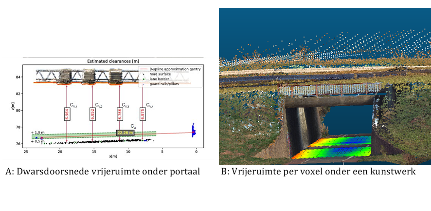

# Toepassingen

De toepassing van 3D Tiles vinden we al terug in verschillende applicaties en 3D digital twins. Ter illustratie zijn hieronder zijn voorbeelden opgenomen van enkele Nederlandse toepassingen die 3D Tiles voor de 3D visualisatie gebruiken.

## BRO praktijkvoorbeeld circulaire grondstromen 
3D Tiles worden gebruikt in de toepassing Circulaire Grondstromen (BRO praktijkvoorbeeld) om complexe en gedetailleerde 3D informatie over grond- en bouwmaterialen efficiënt te visualiseren en te beheren. Dit helpt bij het monitoren, plannen en optimaliseren van het hergebruik van materialen binnen een circulaire economie. Door 3D Tiles in te zetten, kunnen verschillende stakeholders eenvoudig toegang krijgen tot actuele en nauwkeurige data, wat bijdraagt aan een beter begrip van materiaalstromen en bevordert de samenwerking tussen partijen. 
In de toepassing Circulaire Grondstromen gemaakt met CesiumJS zorgt 3D Tiles ervoor dat de prestaties van de webviewer worden gemaximaliseerd. Het proces van het converteren van data naar 3D-tegels binnen de toepassing Circulaire Grondstromen varieert afhankelijk van de databron (zie figuur ?); de 3D tegels worden toegepast voor diverse typen data, zoals het DTB, puntenwolken, basisregistraties en BRO modellen en orthofoto’s. 

<figure id="Figuur_x"> 

<figcaption>3D Tiles gebruik bij BRO praktijkvoorbeeld Circulaire Grondstromen</figcaption>
</figure>

Bronnen: [BRO praktijkvoorbeeld circulaire grondstromen](https://basisregistratieondergrond.nl/doe-mee/begin-dag-bro-tje/bro-tjes-2024/11-januari-2024/datagedreven-duurzamer-her-gebruik-grond/), [Storymap over circulaire grondstromen](https://grondstromen.beta.geodan.nl/?story=circulaire%20grondstromen)

## 3D Rotterdam

Lorem ipsum dolor sit amet.

Bronnen: [www.3drotterdam.nl](http://www.3drotterdam.nl)

## Watermanagement

Lorem ipsum dolor sit amet.

Verbeteren datakwaliteit

## Visualisatie doorrijprofielen

Voor het bepalen van de status van de verschillende assets van Rijkswaterstaat,
worden planimetrische en hoogte-informatie gecombineerd (3D) toegepast. Een
voorbeeld hiervan is het schouwen, inwinnen en valideren van de vrije ruimtes
tussen het wegdek en een asset binnen het brongebied van RWS. Dit doet RWS in
opdracht van de RDW, en zorgt ervoor dat er een veilige doorgang gegarandeerd is
voor persoon, vracht en speciaal vervoer. RWS voert zelf geen data inwinning
uit, en is daarom afhankelijk van de data die geleverd wordt vanuit de
leveranciers.

Hiervoor zijn er eisen gesteld aan de vrije ruimtes, waarbij voor de
hoogtemetingen een relatieve afwijking van 1 cm is vastgesteld (zie ook deze
[link](https://www.rijkswaterstaat.nl/zakelijk/zakendoen-met-rijkswaterstaat/werkwijzen/werkwijze-in-gww/data-eisen-rijkswaterstaatcontracten/doorrijprofielen)).
Omdat deze metingen vaak op snelwegen worden uitgevoerd, kiezen leveranciers
steeds vaker voor het inwinnen van de vrijeruimte met behulp van mobile
laserscanning. Mede doordat dit een efficiënte en veilige methode van inwinning
is. De meting resulteert in een puntenwolk dataset van een asset, waarna de
vrije ruimtes vervolgens worden geconverteerd naar fotobestanden voor een
weergave van de omgeving.

Voor het valideren van de fotobestanden van de leverancier wordt gebruikgemaakt
van 3D-software die ontwikkeld is door de TU Delft en Rijkswaterstaat (zie ook
deze
[link](http://resolver.tudelft.nl/uuid:ca9254d6-0f7b-4999-b62a-763eb5c95397)).
Deze software wordt ingezet om met alternatieve puntenwolken
vergelijkingsmateriaal van hetzelfde asset te maken. Dit stelt Rijkswaterstaat
in staat om het geleverde fotomateriaal te controleren en te verifiëren of de
omschrijvingen in de bewijsvoering (kwaliteitsrapportage) overeenkomen.

De software is gebaseerd op het feit dat het wegdek en het brugdek/portaal
voldoende gesegmenteerd kan worden uit de data, en dat doormiddel van B-splines
een schatting gemaakt kan worden van de onderkant van het object. De resultaten
kunnen op twee manieren worden weergegeven: via de dwarsdoorsnede (Figuur A) of
doormiddel van de voxels van het gehele wegdek (Figuur B).

Figuur B laat het belang zien van het ontsluitingsvraagstuk van dit type dataset
naar de verschillende projectteams en afdelingen binnen Rijkswaterstaat. Dit
stelt een projectteam in staat om een schatting te maken van de verandering van
een asset over tijd, zodat gerichte data inwinning kan plaatsvinden in opdracht
van RWS wanneer een asset zich in een kritieke toestand bevindt. Daarnaast
krijgt de gebruiker ook een inschatting in 3D om te bepalen of een speciaal
transport zich veilig door Nederland kan verplaatsen.
