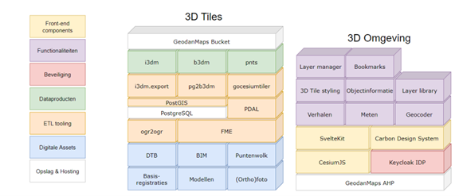
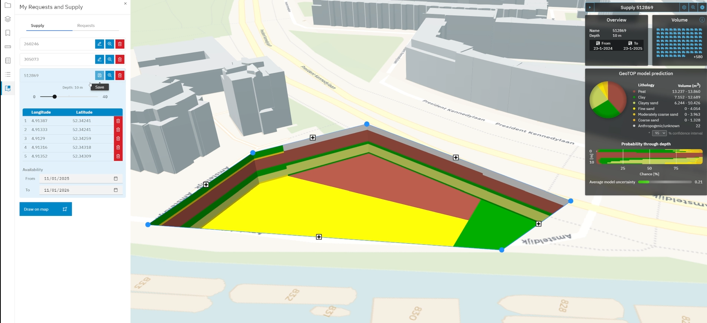

# Toepassingen

De toepassing van 3D Tiles vinden we al terug in verschillende applicaties en 3D digital twins. Ter illustratie zijn hieronder zijn voorbeelden opgenomen van enkele Nederlandse toepassingen die 3D Tiles voor de 3D visualisatie gebruiken.

## BRO praktijkvoorbeeld circulaire grondstromen 
3D Tiles worden gebruikt in de toepassing Circulaire Grondstromen (BRO praktijkvoorbeeld) om complexe en gedetailleerde 3D informatie over grond- en bouwmaterialen efficiënt te visualiseren en te beheren. Dit helpt bij het monitoren, plannen en optimaliseren van het hergebruik van materialen binnen een circulaire economie. Door 3D Tiles in te zetten, kunnen verschillende stakeholders eenvoudig toegang krijgen tot actuele en nauwkeurige data, wat bijdraagt aan een beter begrip van materiaalstromen en bevordert de samenwerking tussen partijen. 
In de toepassing Circulaire Grondstromen gemaakt met CesiumJS zorgt 3D Tiles ervoor dat de prestaties van de webviewer worden gemaximaliseerd. Het proces van het converteren van data naar 3D-tegels binnen de toepassing Circulaire Grondstromen varieert afhankelijk van de databron (zie figuur ); de 3D tegels worden toegepast voor diverse typen data, zoals het DTB, puntenwolken, basisregistraties en BRO modellen en orthofoto’s. 

<figure id="Figuur_x">

<figcaption>3D Tiles gebruik bij BRO praktijkvoorbeeld Circulaire Grondstromen (bron: Geodan)</figcaption>
</figure>

<figure id="Figuur_x">

<figcaption>3D Tiles weergave bij BRO praktijkvoorbeeld Circulaire Grondstromen (bron: Geodan)</figcaption>
</figure>

Bronnen: [BRO praktijkvoorbeeld circulaire grondstromen](https://basisregistratieondergrond.nl/doe-mee/begin-dag-bro-tje/bro-tjes-2024/11-januari-2024/datagedreven-duurzamer-her-gebruik-grond/), [Storymap over circulaire grondstromen](https://grondstromen.beta.geodan.nl/?story=circulaire%20grondstromen).

## 3D Rotterdam

De gemeente Rotterdam stelt het 3D-stadsmodel van Rotterdam vrij ter beschikking aan iedereen die daarmee aan de slag wil gaan. De gemeente wil hiermee het gebruik en toepassingen van deze unieke dataset stimuleren bij scholen en universiteiten, overheids- en Rotterdamse diensten, gamers, het bedrijfsleven uit binnen- en buitenland maar ook bewoners. Zij kunnen met de juiste tools Rotterdam op een manier in beeld brengen die op een platte kaart onmogelijk is. Rotterdam 3D is een driedimensionale (3D) weergave van de gemeente gebaseerd op tweedimensionale (2D) kaarten, hoogtemetingen, luchtfoto’s en beheergegevens. Rotterdam 3D (zie figuur 2) maakt gebruik van 3D Tiles en bestaat niet alleen uit gebouwen. Ook bomen, lantaarnpalen en kabels en leidingen zijn inmiddels in 3D en via 3D Tiles beschikbaar. Tilesets van Rotterdam 3D zijn ook te downloaden via [link](https://3dtilesnederland.nl). Het toegankelijk maken van Rotterdam 3D biedt Rotterdammers de mogelijkheid mee te bouwen aan de stad. De gegevens zijn daarom compleet, actueel en gratis voor hergebruik.

In de onderstaande figuren zijn enkele voorbeelden opgenomen van het 3D Tiles in Rotterdam 3D. In figuur 2 zijn de getextureerde gebouwen tezamen met de getextureerde bomen op een luchtfoto afgebeeld. Hierdoor creëer je al snel een ‘realistisch’ digitaal beeld van de stad.

<figure id="Figuur_x"> 

<figcaption>3D Tiles visualisatie van getextureerde gebouwen en bomen in Rotterdam 3D (bron: gemeente Rotterdam)</figcaption>
</figure>

Benieuwd of er nog een plaatsje vrij is onder de straat voor een ondergrondse vuilcontainer? 3D Rotterdam biedt de mogelijkheden voor een kijkje in de ondergrond (figuur 3).

<figure id="Figuur_x"> 

<figcaption>Een 3D Tiles kijkje in de Rotterdamse ondergrond (bron: gemeente Rotterdam)</figcaption>
</figure>

Met behulp van een 3D viewer, die alleen beschikbaar is voor de medewerkers van de gemeente Rotterdam, zorgt 3D Tiles ervoor dat de medewerkers snel en intuïtief gegevens kunnen ophalen van assets in de stad. Dit behelst niet alleen gebouwen maar ook straatmeubilair, groenvoorziening, etc.. Vanuit het gemeentelijk datafundament, waarin onder andere de BAG, de BGT, de WOZ, de TIR en de BOR zijn opgenomen, kunnen data analyses in samenhang worden uitgevoerd en vragen worden beantwoord, zoals hoeveel hoekwoningen een wijk heeft (figuur 4) of welke panden bevatten specifieke materialen in het dak? Ook het vergelijken van panden en hun attributen uit verschillende registraties WOZ en BAG: Welke object pas niet in het rijtje? (figuur 5). 

<figure id="Figuur_4"> 

<figcaption>Alle hoekwoningen in de wijk Ommoord (bron: gemeente Rotterdam)</figcaption>
</figure>

<figure id="Figuur_5"> 

<figcaption>3D Tiles ingezet voor het vergelijken van pandattributen uit WOZ en BAG (bron: gemeente Rotterdam)</figcaption>
</figure>

De 3D tilesets bevatten ook panden als geheel en kunnen de verblijfsobjecten in de toekomst ook identificeren en informatie over de verblijfsobjecten opvraagbaar maken (zie figuur ?).

<figure id="Figuur_6"> 

<figcaption>3D Tiles ingezet voor het identificeren en opvraagbaar maken van informatie over verblijfsobjecten (bron: gemeente Rotterdam)</figcaption>
</figure>

Bronnen: [www.3drotterdam.nl](http://www.3drotterdam.nl)

## Wateroverlast door extreme buien

Lorem ipsum dolor sit amet.

## Visualisatie doorrijprofielen

Voor het bepalen van de status van de verschillende assets van Rijkswaterstaat,
worden planimetrische en hoogte-informatie gecombineerd (3D) toegepast. Een
voorbeeld hiervan is het schouwen, inwinnen en valideren van de vrije ruimtes
tussen het wegdek en een asset binnen het brongebied van RWS. Dit doet RWS in
opdracht van de RDW, en zorgt ervoor dat er een veilige doorgang gegarandeerd is
voor persoon, vracht en speciaal vervoer. RWS voert zelf geen data inwinning
uit, en is daarom afhankelijk van de data die geleverd wordt vanuit de
leveranciers.

Hiervoor zijn er eisen gesteld aan de vrije ruimtes, waarbij voor de
hoogtemetingen een relatieve afwijking van 1 cm is vastgesteld (zie ook deze
[link](https://www.rijkswaterstaat.nl/zakelijk/zakendoen-met-rijkswaterstaat/werkwijzen/werkwijze-in-gww/data-eisen-rijkswaterstaatcontracten/doorrijprofielen)).

Omdat deze metingen vaak op snelwegen worden uitgevoerd, kiezen leveranciers
steeds vaker voor het inwinnen van de vrijeruimte met behulp van mobile
laserscanning. Mede doordat dit een efficiënte en veilige methode van inwinning
is. De meting resulteert in een puntenwolk dataset van een asset, waarna de
vrije ruimtes vervolgens worden geconverteerd naar fotobestanden voor een
weergave van de omgeving.

Voor het valideren van de fotobestanden van de leverancier wordt gebruikgemaakt
van 3D-software die ontwikkeld is door de TU Delft en Rijkswaterstaat (zie ook
deze [link](https://repository.tudelft.nl/islandora/object/uuid:ca9254d6-0f7b-4999-b62a-763eb5c95397?collection=education)).
Deze software wordt ingezet om met alternatieve puntenwolken
vergelijkingsmateriaal van hetzelfde asset te maken. Dit stelt Rijkswaterstaat
in staat om het geleverde fotomateriaal te controleren en te verifiëren of de
omschrijvingen in de bewijsvoering (kwaliteitsrapportage) overeenkomen.

De software is gebaseerd op het feit dat het wegdek en het brugdek/portaal
voldoende gesegmenteerd kan worden uit de data, en dat doormiddel van B-splines
een schatting gemaakt kan worden van de onderkant van het object. De resultaten
kunnen op twee manieren worden weergegeven: via de dwarsdoorsnede (Figuur A) of
doormiddel van de voxels van het gehele wegdek (Figuur B).

<figure id="Figuur_x"> 

<figcaption>3D Tiles ingezet voor het weergegeven van point clouds (bron: Rijkswaterstaat)</figcaption>
</figure>

Figuur B laat het belang zien van het ontsluitingsvraagstuk van dit type dataset
naar de verschillende projectteams en afdelingen binnen Rijkswaterstaat. Dit
stelt een projectteam in staat om een schatting te maken van de verandering van
een asset over tijd, zodat gerichte data inwinning kan plaatsvinden in opdracht
van RWS wanneer een asset zich in een kritieke toestand bevindt. Daarnaast
krijgt de gebruiker ook een inschatting in 3D om te bepalen of een speciaal
transport zich veilig door Nederland kan verplaatsen.
