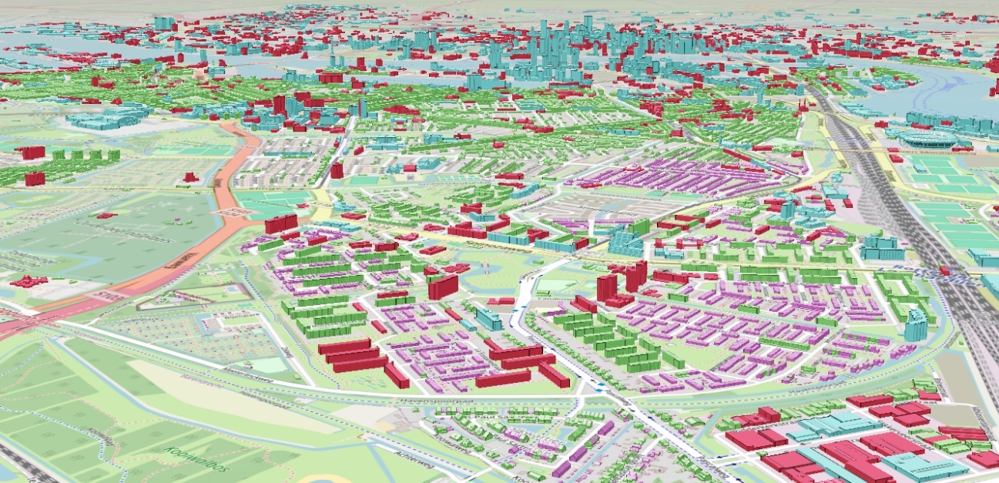

# Toolkit

## Handleidingen

In deze sectie vind je een verzameling handleidingen en how-to's die je
stapsgewijs begeleiden bij het werken met 3D Tiles. Of je nu een beginner bent
die net begint met het gebruik van 3D Tiles of een ervaren ontwikkelaar die op
zoek is naar geavanceerde tips en technieken, deze handleidingen bieden
praktische instructies en voorbeelden om je te helpen bij het maken, laden,
visualiseren en optimaliseren van 3D-gegevenssets met behulp van 3D Tiles.

### HowTo: QuickStartGuide 3D Tiles

<https://3dtilesnederland.nl/quick-start-guide/>

### HowTo: 3D Tiles in Mapbox

<https://github.com/Geodan/mapbox-3dtiles?tab=readme-ov-file>

### HowTo: Genereren van 3D tiles met Virtual City Systems

Bij het genereren van 3D tilesets kunnen een aantal parameters in Virtual City
Systems toegepast worden die invloed hebben op de wijze waarop deze tilesets
getoond worden in een viewer. Deze parameters zijn:

-   Levels

-   CityGML Level of Detail (0, 1, 2, 3, 4)

-   Refinement (Add, Replace)

-   Object size filter

-   Geometry generalization

-   Textures (CityGML Appearance, Single color, Specify colors based on CityGML
    classes)

Er is geen aanbeveling mogelijk voor één set aan instellingen, omdat dit
afhankelijk is van de input-data, de visuele presentatie en ook de persoonlijke
smaak. Daarnaast zijn verschillende parameters onderling afhankelijk van elkaar.

#### Levels

Bij deze optie wordt gekozen op welk zoomlevel een tileset wordt aangemaakt. Het
is mogelijk meerdere levels in te stellen, die gezamenlijk een tileset vormen.
Voor elk level moeten dan de hieronder beschreven parameters ingesteld worden.
Levels die vaak gebruikt worden zijn 14, 15 en 16. Het level met het laagste
getal is degene die als eerste wordt geladen in een viewer. De objecten in dit
level liggen verder weg van het viewpoint dan de die in de hogere levels. Bij
het aanmaken van de levels wordt op de achtergrond een Geometric Error toegekend
aan elk level. Het laagste level heeft de hoogste Geometric Error.

#### CityGML Level of Detail

Bij deze optie wordt gekozen welk Level of Detail gebruikt wordt die in de
CityGML-data aanwezig is. Voor gebouwen geldt dat LoD1 een eenvoudig
blokkenmodel is en LoD2 dakvormen heeft. LoD1 bevat minder detail, dus is ook
sneller in te laden. Omdat van veraf minder detail te zien is, kan ervoor worden
gekozen om op een lager zoomlevel LoD1 te gebruiken en in dezelfde tileset op
een hoger zoomlevel LoD2 te gebruiken. Dit kan het laadproces gunstig
beïnvloeden.

Het is ook raadzaam om een fallback LOD in te stellen, zoals LOD1, voor het
geval er geen LOD2 beschikbaar is in de brondataset. In formaten zoals CityGML
of CityJSON kunnen meerdere LODs voor een object worden opgenomen. Als het
voorkeurs LOD niet beschikbaar is, zal het systeem automatisch teruggrijpen naar
het fallback LOD om het object op te nemen in de 3D Tile.

<https://geonovum.github.io/IMGeo-dev/catalogus/imgeo/media/878e3b785d756b4ed69cacd71c875236.png>

#### Object size filter

Deze optie is alleen te gebruiken bij de Add refinement. Voor elk zoomlevel kan
een object size gekozen worden, die gebaseerd is op de diagonaal van het object.
Bijvoorbeeld op level 14 alle gebouwen groter dan 100m, op level 15 alle
gebouwen tussen 50m en 100m en op level 16 alle gebouwen kleiner dan 50m.

#### Geometry generalization

Deze optie is alleen te gebruiken bij de Replace refinement. Voor elk zoomlevel
kan een generalisatie toegepast worden, waarbij een marge wordt opgegeven
waarbinnen vertices van een object samengevoegd worden. Bijvoorbeeld op level 14
een generalisatie van 5m, op level 15 van 2m en op level 16 geen generalisatie.

#### Textures

Bij het gebruik van CityGML Appearance kunnen bijvoorbeeld getextureerde
gebouwen aangemaakt worden. Het is niet aan te raden om hierbij LoD1 en 2 te
gebruiken, omdat LoD1 geen textures bevat. Het is wel mogelijk dit met object
size filter óf generalisatie te combineren. Het is verder mogelijk voor
verschillende zoomlevels de kwaliteit van de texture aan te passen, omdat van
veraf minder detail te zien is dan dichtbij.

Als voor Single color wordt gekozen is het wel goed mogelijk LoD1 en LoD2 te
combineren in de verschillende zoomlevels. Er wordt maar één kleur toegepast
voor alle objecten, eventueel met transparantie. Hierbij is het onderscheidt
tussen LoD1 en LoD2 op grote afstand niet te zien.

Bij het gebruik van Specify color based on CityGML classes krijgt elk vlak van
een gebouw zijn eigen kleur, mits ze gespecificeerd zijn in CityGML. Daken
worden bijvoorbeeld rood en muren grijs. Deze kleuren zijn aan te passen. Dit
geldt dan alleen voor LoD2 en hoger en daarom is het niet aan te raden om LoD1
en LoD2 te combineren in verschillende zoomlevels.

#### Refinement

Bij Refinement kan tussen de opties Add en Replace gekozen worden, die aan de
hand van onderstaande scenario’s worden toegelicht.

Als je in de verte kijkt, zie je in principe alleen maar grote gebouwen staan.
De kleine zijn niet zichtbaar doordat ze überhaupt te klein zijn of achter een
groter gebouw staan. Je kunt er dan voor kiezen om in de verte alleen grote
gebouwen te tonen. Iets dichterbij wil je alleen de grote en de middelgrote
gebouwen zien. En heel dichtbij ook de kleine gebouwen. Door de Add refinement
te gebruiken, wordt er een tileset aangemaakt met bijvoorbeeld op zoomniveau 14
de grote gebouwen, op zoomniveau 15 de middelgrote gebouwen en op zoomniveau 16
de kleine gebouwen. Elk gebouw komt maar 1x voor in de gehele tileset. Door het
inzoomen worden steeds meer gebouwen toegevoegd aan je view. Een nadeel is dat
het vaak wel opvalt dat er in de verte gebouwen ontbreken (zie bijvoorbeeld figuur 16).

<figure id="Figuur_x"> 
<a href="media/9eb82df57c2a50ab283807e3343f0e3c.jpeg" target="_blank"></a>
<figcaption>Vooorbeeld Refinement toegepast voor gebouwen</figcaption>
</figure>

Als je in de verte kijkt, zie je weinig detail van gebouwen. Je kunt ervoor
kiezen om de geometrie wat te generaliseren, zodat de tileset minder zwaar
wordt. Bijvoorbeeld op zoomniveau 14 een generalisatie van 5m, op niveau 15 van
2m en op niveau 16 geen generalisatie. Hoe meer je inzoomt, hoe gedetailleerder
een gebouw moet zijn. Wat hier gebeurd is dat elk gebouw op elk zoomniveau
gegenereerd wordt. Elk gebouw komt dus 3x voor. Voordeel is dat je in de verte
altijd alle gebouwen ziet, maar het is vaak lastig in te stellen op welk
zoomniveau, welke generalisatie je toe moet passen. Daardoor blijft de
generalisatie vaak zichtbaar.

## Viewers, generators en servers

In deze sectie vind je een overzicht van verschillende viewers en servers die
compatibel zijn met 3D Tiles. Of je nu op zoek bent naar een krachtige 3D-engine
om je 3D Tiles te visualiseren of een robuuste serveroplossing om je gegevens te
hosten, hier vind je een selectie van tools en platforms die je kunnen helpen
bij het werken met 3D Tiles. Van populaire game-engines tot gespecialiseerde
web-based viewers, deze lijst biedt een breed scala aan opties om aan je
specifieke behoeften te voldoen.

Voor een overzicht van nog meer viewers, zie

<https://github.com/pka/awesome-3d-tiles?tab=readme-ov-file>

### Viewers

#### Cesium

[Cesium](https://github.com/CesiumGS/cesium) is een krachtige open-source
JavaScript-bibliotheek voor het maken van 3D-kaarten in de browser. Het biedt
ondersteuning voor het laden en weergeven van 3D Tiles, waardoor gebruikers
complexe 3D-gegevenssets kunnen visualiseren en analyseren in hun
webapplicaties.


Voorbeeld code:

```javascript
 var tileset = viewer.scene.primitives.add(new Cesium.Cesium3DTileset({
     url : 'tileset.json'
}));
```

#### Unity

[Unity](https://unity.com/) is een populaire game-engine die wordt gebruikt voor
het maken van 3D- en 2D-games, simulaties en visualisaties. Met de Unity engine
kunnen ontwikkelaars 3D Tiles integreren om complexe geografische gegevenssets
te visualiseren en interactieve 3D-omgevingen te creëren.

#### Unreal Engine

[Unreal Engine](https://www.unrealengine.com/) is een krachtige game-engine die
wordt gebruikt voor het maken van hoogwaardige 3D-content, waaronder games,
simulaties en visualisaties. Het ondersteunt de integratie van 3D Tiles,
waardoor ontwikkelaars gedetailleerde en realistische 3D-omgevingen kunnen maken
met behulp van de Unreal Engine.

#### deck.gl

[dec**k.gl**](https://deck.gl/docs/api-reference/geo-layers/tile-3d-layer) is
een op WebGL gebaseerde 3D-rendering-engine die wordt gebruikt voor het maken
van geavanceerde 3D-visualisaties in de browser. Het ondersteunt de weergave van
3D Tiles, waardoor gebruikers gedetailleerde en interactieve 3D-gegevenssets
kunnen bekijken en analyseren.

Voorbeeld code:

```javascript
const TILESET_URL = `tileset.json`;

const tile3DLayer = new Tile3DLayer({
    id: 'tile-3d-layer',
    pointSize: 2,
    data: TILESET_URL
});

return <DeckGL initialViewState={initialViewState} controller={true} layers={[tile3DLayer]} />;
  ```

#### Esri JavaScript SDK / ArcGIS Server

De [Esri JavaScript
API](https://developers.arcgis.com/javascript/latest/api-reference/esri-layers-IntegratedMesh3DTilesLayer.html)
biedt een krachtig platform voor het maken van webmapping-applicaties. Het
ondersteunt de integratie van 3D Tiles, waardoor ontwikkelaars complexe
3D-gegevenssets kunnen visualiseren en analyseren in hun webapplicaties.

Voorbeeld code: 

```javascript
const layer = new IntegratedMesh3DTilesLayer({url: "tileset.json",title: "3D Tiles"});
webscene.add(layer);
```

#### QGIS

De open source GIS applicatie QGIS biedt een [QGIS plugin](https://plugins.qgis.org/planet/tag/3d%20tiles/) voor voor de 3D scenes weergave van 3D Tiles datasets. De weergave van een 3D Tiles dataset kan worden aangepast door gebruik te maken van de stylingopties in QGIS. Dit omvat kleurtoewijzing, doorzichtigheid en andere visuele instellingen om de data beter in 3D te presenteren. Een van de voordelen van QGIS is de mogelijkheid om 3D Tiles datasets te combineren met andere GIS-data, zoals vectorlagen, rasterdata, en terreinmodellen. Dit maakt het mogelijk om complexe analyses uit te voeren en rijke visualisaties te creëren in QGIS.

#### 3d-tiles-renderer

[3DtilesRendererJS](https://github.com/NASA-AMMOS/3DTilesRendererJS) is een
JavaScript-bibliotheek die is ontworpen voor het renderen van 3D Tiles in
webapplicaties. Het biedt ondersteuning voor het laden en weergeven van
3D-gegevenssets, waardoor ontwikkelaars gedetailleerde en interactieve
3D-visualisaties kunnen maken in de browser.

Voorbeeld code: 

```javascript
const tilesRenderer = new TilesRenderer( 'tileset.json' );
tilesRenderer.setCamera( camera );
tilesRenderer.setResolutionFromRenderer( camera, renderer );
scene.add( tilesRenderer.group );

renderLoop();

function renderLoop() {
	requestAnimationFrame( renderLoop );
	camera.updateMatrixWorld();
	tilesRenderer.update();
	renderer.render( scene, camera );
}
```

### Generators en servers

#### Tyler

[Tyler](https://github.com/3DGI/tyler) is een innovatieve tool die speciaal is
ontworpen om 3D-tegels te maken van 3D-stadsobjecten. Het biedt een efficiënte
manier om CityJSON-functies om te zetten in geavanceerde 3D Tiles v1.1-formaat,
wat essentieel is voor het visualiseren en beheren van stedelijke gegevens in
drie dimensies.

Tyler neemt CityJSON-functies als invoer, waarbij elke functie afzonderlijk
wordt opgeslagen in een apart bestand. Vervolgens genereert Tyler 3D Tiles v1.1
als uitvoer. De belangrijkste kenmerken van de 3D Tiles-uitvoer zijn:

-   Binaire glTF (.glb): De inhoud van de tileset is in binair glTF-formaat.

-   Feature Metadata: De glTF-assets bevatten metadata per CityObject,
    gebruikmakend van EXT_mesh_features en EXT_structural_metadata extensies.

-   Ingekleurde Objecten: De objecten zijn voorzien van standaardkleuren, die
    per CityObject-type kunnen worden aangepast.

-   Compressie: De glTF-bestanden zijn gecomprimeerd met behulp van
    KHR_mesh_quantization en EXT_meshopt_compression extensies.

-   Impliciete Tiling: Ondersteuning voor impliciete tegelstructuren is
    optioneel beschikbaar.

#### pg2b3dm

[pg2b3dm](https://github.com/Geodan/pg2b3dm) is een tool waarmee 3D-geometrieën
vanuit PostGIS kunnen worden omgezet naar 3D Tiles. De gegenereerde 3D Tiles
kunnen worden gevisualiseerd in Cesium JS, Cesium for Unreal, Cesium for
Unity3D, Cesium for Omniverse, QGIS, ArcGIS Pro, ArcGIS Maps SDK for JavaScript,
Mapbox GL JS v3 (experimenteel) of andere 3D Tiles client viewers.

#### I3dm.export

[I3dm.export](https://github.com/Geodan/i3dm.export) i3dm.export is een consoletool waarmee 
Instanced 3D Tiles gemaakt kunnen worden vanuit een PostGIS-tabel met punt geometrie. Deze tegels bevatten 
informatie over locatie, binair glTF-model (glb), schaal, rotatie en instantie-attributen. 
Zowel 3D Tiles 1.0 (via i3dm’s) als 3D Tiles 1.1 (via glTF extensie EXT_mesh_gpu_instancing) kunnen worden 
gegenereerd.

#### VCS

[Virtual City Systems](https://vc.systems/en/) biedt een krachtige tool voor het
genereren van 3D Tiles genaamd "CityServer3D". Met CityServer3D kunnen
gebruikers eenvoudig 3D-gegevens van verschillende bronnen importeren en
converteren naar het 3D Tiles-formaat. De gegenereerde 3D Tiles kunnen
vervolgens worden geïntegreerd in verschillende 3D-georuimtelijke toepassingen
en worden gevisualiseerd in populaire 3D Tiles-clients zoals Cesium, Mapbox GL
JS en andere. CityServer3D biedt ook geavanceerde functionaliteiten voor het
beheren, analyseren en presenteren van 3D-gegevens op schaalbare en efficiënte
wijze.

#### 3D GeoVolumes

De [OGC API – 3D GeoVolumes](https://ogcapi.ogc.org/geovolumes/) is een
krachtige serveroplossing voor het serveren van 3D Tiles. Met deze server kunnen
3D-gegevenssets efficiënt worden gehost en toegankelijk gemaakt voor gebruik in
verschillende 3D-applicaties. Door het gebruik van de OGC API-standaard kunnen
3D Tiles datasets eenvoudig worden gepubliceerd en gedeeld met andere
gebruikers. GeoVolumes biedt een robuuste infrastructuur voor het leveren van
3D-gegevens op schaal, waardoor het ideaal is voor het hosten van grote
3D-modellen en het ondersteunen van geavanceerde 3D-toepassingen.

## 3D Tile Datasets en websites

### 3D basisvoorziening Kadaster

De [3D Basisvoorziening van het
Kadaster](https://api.pdok.nl/kadaster/3d-basisvoorziening/ogc/v1_0) is
beschikbaar op schaalniveaus tussen 1:500 en 1:10.000. De gegevens worden
geleverd als dataset per kaartblad, waarbij u zelf het gewenste kaartblad kunt
selecteren op de kaart van Nederland. De gegevens worden geleverd in een
zip-bestand, waarin een CityJSON-bestand is opgenomen. Een kaartbladbestand van
het 3D Basisbestand Volledig is ongeveer 200-700 MB groot. De kaartbladbestanden
van het 3D Basisbestand Gebouwen zijn aanzienlijk kleiner, terwijl het 3D
Hoogtestatistieken Gebouwen als één bestand voor heel Nederland wordt geleverd
in GeoPackage 1.2.

De 3D Basisvoorziening kan worden toegepast voor verschillende doeleinden, zoals
het maken van 3D-visualisaties, het uitvoeren van analyses van geluidsmodellen,
schaduwanalyses, analyse van zonnepotentie en afwateringsberekeningen. Het vormt
tevens een belangrijke basis voor gemeenten bij de planvorming en uitvoering van
projecten in het kader van de nieuwe Omgevingswet. Daarnaast is het een
waardevol visueel hulpmiddel in de communicatie met burgers over de impact van
plannen op de omgeving.

### 3D Tiles Nederland

[3DTilesNederland.nl](https://3dtilesnederland.nl/3d-tilesets/) is een
samenwerkingsverband tussen de Vereniging van Nederlandse Gemeenten (VNG) en de
gemeenten Rotterdam, Amsterdam en Den Haag. De website zet zich in om het
verzamelen, beheren en benutten van 3D-data binnen gemeenten te bevorderen en te
ondersteunen.

Het streven is om gemeenten te helpen bij het gestandaardiseerd beschikbaar
stellen van lokaal ingewonnen 3D-data door gebruik te maken van de
internationale 3D Tiles-standaard. De website biedt praktische handleidingen,
instructies en ondersteuning voor het maken, publiceren en delen van
gedetailleerde 3D-modellen van steden, inclusief praktische informatie over het
benaderen van gepubliceerde 3D-data.

Daarnaast biedt 3DTilesNederland.nl verschillende tools zoals CesiumJS, Unreal
en Unity (Netherlands 3D) waarmee gemeenten realistische virtuele tours,
simulaties en trainingen kunnen ontwikkelen om burgers te informeren en
betrekken bij stadsplanning en andere gemeentelijke projecten.

### Netherlands3D

[Netherlands3D](https://netherlands3d.eu/) is een open-source Digitaal
Twin-framework dat is ontworpen voor Nederland. Met Netherlands3D kun je
gedetailleerde, op data gebaseerde modellen maken door middel van data
visualisatie.
